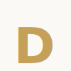

# ✨ Edutra Nails - Luxury Landing Page

<div align="center">
  
  <p align="center">
    <strong>Landing Page de alto padrão para Nail Designers</strong><br />
    <em>Moderna, Minimalista, Luxuosa e "Clean Girl Aesthetic"</em>
  </p>
</div>

---

## 💅 Sobre o Projeto

O **Edutra Nails** é uma Landing Page premium desenvolvida especificamente para profissionais do ramo de estética que buscam uma presença digital sofisticada. O design foi cuidadosamente planejado seguindo a tendência _Clean Girl Aesthetic_, utilizando tons de areia, off-white, rosa quartzo suave e detalhes em dourado champagne.

## 🚀 Funcionalidades

- **✨ Design de Alto Padrão:** Estética minimalista e luxuosa.
- **📱 Totalmente Responsivo:** Experiência perfeita em dispositivos móveis, tablets e desktops.
- **📝 Blog Integrado:** Sistema de blog completo com páginas dinâmicas para posts e dicas.
- **💬 CTA Estratégico:** Botão de WhatsApp flutuante com efeito de pulso e mensagens pré-definidas para agendamento.
- **🎞️ Animações Modernas:** Efeitos de scroll (reveal), barra de progresso de leitura e transições suaves com Framer Motion.
- **🧭 Navegação Inteligente:** Suporte a Smooth Scroll na Home e roteamento dinâmico para páginas internas.

## 🛠️ Tecnologias Utilizadas

- **React 18** - Biblioteca principal para construção da interface.
- **Vite** - Build tool ultra-rápida.
- **Framer Motion** - Biblioteca para animações fluidas e modernas.
- **React Router 6** - Gerenciamento de rotas e navegação.
- **Lucide React** - Conjunto de ícones elegantes e minimalistas.
- **Vanilla CSS** - Estilização customizada com foco em performance e design system próprio.

## 🎨 Paleta de Cores

| Cor       | Hex       | Aplicação          |
| --------- | --------- | ------------------ |
| Sand      | `#F5F1ED` | Fundos e Seções    |
| Quartz    | `#FBEAEB` | Detalhes e Badges  |
| Gold      | `#C5A059` | Destaques e Botões |
| Terracota | `#C27B6B` | Botão WhatsApp     |
| Off-White | `#FAF9F6` | Fundo Principal    |

## 📦 Como rodar o projeto localmente

1. **Clone o repositório:**

   ```bash
   git clone https://github.com/DanielBGC/dutra-nails.git
   ```

2. **Entre no diretório:**

   ```bash
   cd dutra-nails
   ```

3. **Instale as dependências:**

   ```bash
   npm install
   ```

4. **Inicie o servidor de desenvolvimento:**

   ```bash
   npm run dev
   ```

5. **Acesse no navegador:**
   `http://localhost:5173`

## 📧 Contato

- **Nail Designer:** Edutra Nails
- **WhatsApp:** (34) 8428-5707
- **Instagram:** [@edutra_nails](https://instagram.com/edutra_nails)
- **Email:** contato@dutranails.com
- **Localização:** Uberaba, MG - Brasil

---

<p align="center">Desenvolvido com ❤️ para elevar sua presença digital.</p>
